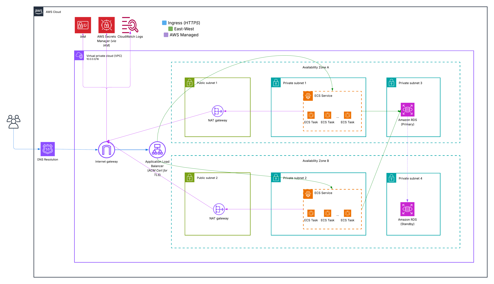

# AWS Cloud Security Operations & DevSecOps Project



A production-patterned AWS infrastructure project demonstrating cloud security engineering: secure networking, least-privilege IAM, secrets management, containerized deployment, detection and incident response, and DevSecOps pipeline security.

Built to be deployed, torn down, and redeployed from a single command.

## Architecture

<!-- TODO: Add architecture diagram -->

### Components
| Layer | Service | Purpose |
|-------|---------|---------|
| Networking | VPC, Public/Private Subnets, NAT Gateway | Network isolation — compute and data in private subnets |
| Compute | ECS Fargate | Serverless container orchestration |
| Load Balancing | ALB + ACM | HTTPS termination with valid TLS certificate |
| Data | RDS PostgreSQL | Managed relational database in private subnet |
| Secrets | AWS Secrets Manager | Runtime credential injection, no plaintext secrets |
| Registry | ECR | Private container image storage |
| Observability | CloudWatch Logs | Centralized container and application logging |

## Security Controls

| Control | Implementation | Evidence |
|---------|---------------|----------|
| Network isolation | ECS tasks and RDS in private subnets, ALB in public | Security group rules in Terraform |
| Least-privilege IAM | Scoped task role and execution role | IAM policy snippets |
| Secrets management | DB credentials via Secrets Manager, injected at runtime | Task definition config |
| TLS/HTTPS | ALB listener with ACM certificate | ALB listener configuration |
| No broad ingress | Security groups scoped to specific ports and sources | SG rule audit |
| Non-root container | Application runs as non-root user | Dockerfile USER directive |

## Quick Start

### Prerequisites
- AWS CLI configured with appropriate credentials
- Terraform >= 1.0
- Docker with buildx support
- GNU Make

### Deploy
```bash
make deploy
```
This runs: `terraform apply` → `build & push images` → `DB init` → `scale up ECS service`

### Verify
```bash
curl https://api.zachmaestas-capstone.com/health
curl https://api.zachmaestas-capstone.com/ready
```

### Destroy
```bash
make destroy
```

## Project Phases

### Phase 1: Secure Baseline Infrastructure — ✅ Complete
Reproducible Terraform deployment producing a working HTTPS endpoint: ALB → ECS Fargate → RDS, with Secrets Manager integration and least-privilege IAM.

Key work:
- VPC with public/private subnet isolation across availability zones
- ECS Fargate with task-level secrets injection
- RDS PostgreSQL with security group scoped access
- Bootstrap method using ECS db_init task for repeatable teardown/rebuild

### Phase 2: Cloud Security — Detection, Monitoring, and Incident Response — 🔲 Next
Demonstrate operational security capabilities: detect threats, investigate findings, and respond to incidents.

Planned work:
- CloudTrail enabled and queryable for audit trails
- GuardDuty for threat detection with Security Hub aggregation
- CloudWatch log organization with documented triage workflow
- Automated response via EventBridge and Lambda
- Simulated security incident with full detect → investigate → respond lifecycle
- Written incident narrative documenting detection, response, and lessons learned
- Python scripting for detection and triage automation

### Phase 3: DevSecOps — Pipeline Security Gates — 🔲 Planned
Shift security left by embedding scanning and policy enforcement into the development workflow.

Planned work:
- GitHub Actions with OIDC-based AWS authentication (no stored credentials)
- Security scanning: secret detection, IaC scanning (tfsec/checkov), container image scanning
- Deliberate vulnerability introduction → scanner detection → documented remediation
- Pipeline gates that block merges on security failures
- Before/after evidence showing the security feedback loop in action

## Evidence

Evidence artifacts for completed phases are in [`docs/evidence/`](docs/evidence/).

## Known Limitations

- Single environment (dev) — multi-environment separation is out of scope for this project
- ECR repository and ECS cluster names are hardcoded in deployment scripts
- Cost-optimized for portfolio use — designed for full teardown/rebuild, not persistent uptime

## Tech Stack

| Tool | Version | Purpose |
|------|---------|---------|
| Terraform | >= 1.0 | Infrastructure as Code |
| AWS ECS Fargate | - | Container orchestration |
| Flask + Gunicorn | Python 3.x | API application |
| PostgreSQL | 15 | Relational database (RDS) |
| Docker | buildx | Container builds |

## Documentation

- [Deployment Guide](docs/deployment.md) — deploy, verify, teardown, and troubleshooting
- [Security Design](docs/security.md) — security controls, IAM design, and trade-off rationale

## Repository Structure

```
.
├── application/
│   └── backend/              # Flask API (Dockerfile, app.py, Gunicorn)
├── infrastructure/
│   ├── scripts/
│   │   ├── db_init/          # DB initialization container
│   │   └── deploy/           # Build, init, and scale scripts
│   └── terraform/
│       ├── backend-state-init/   # Bootstrap for remote state (S3 + DynamoDB)
│       ├── ci-oidc/              # GitHub Actions OIDC federation
│       └── modules/              # network, app, data, secrets, acm
├── Makefile                  # Deploy/destroy orchestration
└── README.md
```

## Related Projects

This project builds on [Secure AWS Architecture Capstone](https://github.com/Zach-Maestas/secure-aws-architecture-capstone), which established the foundational VPC architecture and EC2-based deployment. This project evolved that baseline to ECS Fargate with secrets injection, and adds security operations and DevSecOps capabilities.
